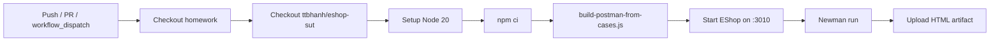

# CI/CD Report — HW06 API Testing

**Student:** Huỳnh Gia Âu (23127153)  
**Pipeline:** `.github/workflows/api-tests.yml`  
**Repository:** https://github.com/huynhgiaau27112005/23127153-hw06-ai-api

## Pipeline Overview



## Triggers

| Event | Condition |
|-------|-----------|
| `push` | `main` or `master`, paths: test-cases, postman, scripts, workflow |
| `pull_request` | Target `main` or `master` |
| `workflow_dispatch` | Manual with `fail_one_test` input (`true`/`false`) |

## Workflow Inputs

| Input | Type | Default | Effect |
|-------|------|---------|--------|
| `fail_one_test` | choice | `false` | When `true`, adds `--bail` to Newman (stop on first failure) |

## Two Sample Runs (required)

| # | Input | Run URL | Conclusion |
|---|-------|---------|------------|
| 1 | `fail_one_test=false` (full suite) | https://github.com/huynhgiaau27112005/23127153-hw06-ai-api/actions/runs/33755055651 | Job completed; Newman exit ≠ 0 due to known SUT bugs (documented). Artifact `newman-report` uploaded. |
| 2 | `fail_one_test=true` (`--bail`) | https://github.com/huynhgiaau27112005/23127153-hw06-ai-api/actions/runs/33755064475 | Job completed; stops earlier on first failure. Artifact uploaded. |

Screenshots of these runs: open the Actions URLs above (workflow_dispatch details show the input values). CI HTML report is available as the `newman-report` artifact on each run.

## Steps Detail

1. **Checkout homework** — `actions/checkout@v4`
2. **Checkout SUT** — `ttbhanh/eshop-sut` into `eshop-sut/`
3. **Node setup** — v20 with npm cache
4. **Install** — `npm ci` fallback to `npm install`
5. **Build collection** — `node scripts/build-postman-from-cases.js`
6. **Start SUT** — `PORT=3010 node server.js` in `eshop-sut/backend` (wait loop for `/api/products`)
7. **Newman** — full collection, `cli` + `htmlextra` reporters
8. **Artifact** — uploads `reports/newman-ci.html` (always)

## Local Equivalent

```powershell
.\scripts\run-newman.ps1
.\scripts\run-newman.ps1 -FailOneTest
.\scripts\run-newman.ps1 -Folder "FR-02 Login"
```

## Known CI Limitations

1. State-dependent tests (login lockout, deletes) may fail in a full sequential suite
2. `continue-on-error` on Newman keeps the workflow green so artifacts always upload for grading
3. Some assertions document real SUT defects (see `docs/bugs.md` + GitHub Issues #1–#6)

## Recommendations

- Split pools into parallel matrix jobs
- Fail the job on Newman exit code after artifact upload (stricter gate)
- Seed dedicated users per CI run to avoid lockout interference
