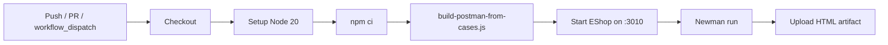

# CI/CD Report — HW06 API Testing

**Student:** Huỳnh Gia Âu (23127153)  
**Pipeline:** `.github/workflows/api-tests.yml`

## Pipeline Overview



## Triggers

| Event | Condition |
|-------|-----------|
| `push` | `main` or `master`, paths: test-cases, postman, scripts, workflow |
| `pull_request` | Target `main` or `master` |
| `workflow_dispatch` | Manual with `fail_one_test` input (`true`/`false`) |

## Workflow Inputs

| Input | Type | Default | Effect |
|-------|------|---------|--------|
| `fail_one_test` | choice | `false` | When `true`, adds `--bail` to Newman (stop on first failure) |

## Steps Detail

1. **Checkout** — `actions/checkout@v4`
2. **Node setup** — v20 with npm cache
3. **Install** — `npm ci` fallback to `npm install`
4. **Build collection** — `node scripts/build-postman-from-cases.js`
5. **Start SUT** — background `PORT=3010 node server.js` in `eshop-sut/backend`
6. **Newman** — full collection, `cli` + `htmlextra` reporters
7. **Artifact** — uploads `reports/newman-ci.html` (always, even on failure)

## Local Equivalent

```powershell
.\scripts\run-newman.ps1
.\scripts\run-newman.ps1 -FailOneTest
.\scripts\run-newman.ps1 -Folder "FR-02 Login"
```

## Configuration

| Setting | Value |
|---------|-------|
| Collection | `postman/23127153_EShop_API.postman_collection.json` |
| Environment | `postman/eshop-local.postman_environment.json` |
| baseUrl | `http://127.0.0.1:3010` |
| Reporters | `cli`, `htmlextra` |

## Known CI Limitations

1. **Sibling repo dependency** — workflow expects `../eshop-sut/backend`; may fail if repo is standalone
2. **SUT startup race** — 3-second sleep may be insufficient on slow runners
3. **continue-on-error** — Newman step set to not fail the job (for homework artifact collection)
4. **State-dependent tests** — lockout and delete tests may interfere in full suite runs

## Recommendations

- Add Docker Compose service for EShop SUT
- Use `services:` container instead of background process
- Split pools into parallel matrix jobs
- Fail the job on Newman exit code after artifact upload

## Sample Run (Local)

```
npm run build
.\scripts\run-newman.ps1 -Report reports/newman-report.html
```

Report: `reports/newman-report.html` — open in browser for pass/fail breakdown per request.
