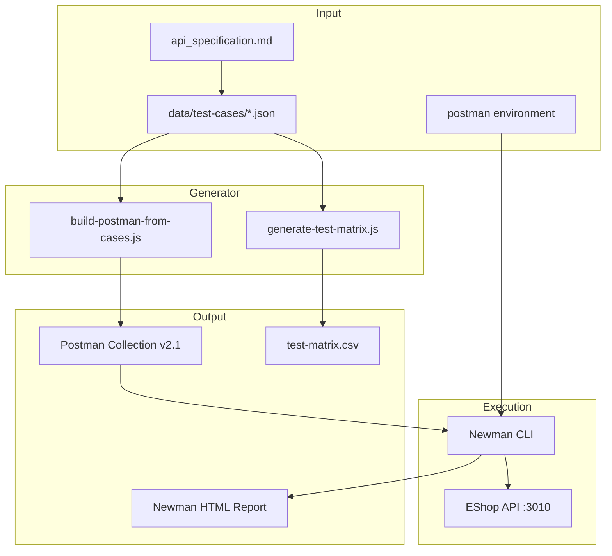
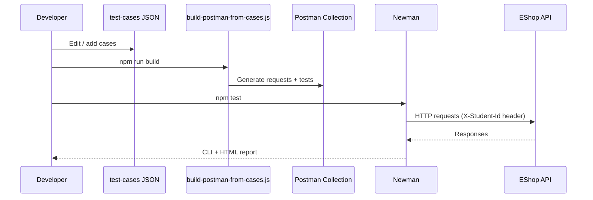

# Test Generator Design — HW06

**Student:** Huỳnh Gia Âu (23127153)

## Architecture



## Data Flow



## JSON Case Schema

```json
{
  "id": "FR02-P01",
  "title": "valid user login returns token",
  "feature": "FR-02",
  "method": "POST",
  "endpoint": "/api/login",
  "category": "positive",
  "auditLabel": "VALID",
  "preconditions": [],
  "headers": { "Content-Type": "application/json" },
  "body": { "email": "test@eshop.com", "password": "Test1234!" },
  "expectedStatus": 200,
  "expectedBodyContains": ["token"],
  "notes": ""
}
```

## Generator Pseudocode

```
FUNCTION buildCollection():
  collection = new PostmanCollection("23127153_EShop_API")
  collection.addPrerequest("pm.request.headers.add({key:'X-Student-Id', value:'23127153'})")
  collection.addFolder("00 Setup", SETUP_REQUESTS)

  FOR EACH pool IN [fr02-login, fr08-checkout, fr19-users]:
    cases = READ_JSON("data/test-cases/" + pool.file)
    folder = new Folder(pool.name)

    FOR EACH case IN cases:
      request = MAKE_REQUEST(case.method, case.endpoint, case.headers, case.body)
      prerequest = BUILD_PREREQUEST(case)  // login, cart, register disposable
      tests = BUILD_TESTS(case.expectedStatus, case.expectedBodyContains)
      folder.add(request, prerequest, tests)

    collection.add(folder)

  WRITE_JSON("postman/23127153_EShop_API.postman_collection.json", collection)
END FUNCTION

FUNCTION BUILD_PREREQUEST(case):
  IF case.pool == "fr08" AND case.needsAuth:
    RETURN loginUser() + addToCart()
  IF case.pool == "fr19" AND case.needsAdmin:
    RETURN loginAdmin()
  IF case.method == "DELETE" AND case.endpoint contains "disposable":
    RETURN registerDisposableUser()
  RETURN empty
END FUNCTION

FUNCTION BUILD_TESTS(expectedStatus, fragments):
  EMIT pm.test("status", () => pm.response.to.have.status(expectedStatus))
  FOR EACH fragment IN fragments:
    EMIT pm.test("body contains", () => pm.expect(pm.response.text()).to.include(fragment))
END FUNCTION
```

## Prerequest Strategy

| Pool | Trigger | Script |
|------|---------|--------|
| FR-02 | FR02-N10 (lockout) | Register user + 2 failed logins |
| FR-08 | Auth header has `userToken` | Login + add AirPods to cart |
| FR-19 | Auth header has `adminToken` | Login admin |
| FR-19 | DELETE disposable user | Register fresh user, set `disposableUserId` |

## Audit Label Rules

```
IF case.id matches STU* THEN label = EXT
ELSE IF preconditions require multi-step state THEN label = INCOMPLETE
ELSE IF expectedStatus >= 400 OR category == negative THEN label = INVALID
ELSE label = VALID
```

## Extension Points

1. Add new pool: create JSON file + entry in `POOLS` array
2. Custom assertions: extend `buildTestScript()` with case.id switches
3. Data-driven: iterate CSV rows instead of JSON (future)
4. Schema validation: add Ajv JSON Schema checks in test scripts

## Files

| File | Role |
|------|------|
| `scripts/build-postman-from-cases.js` | Main generator |
| `scripts/prepare-case-files.js` | Audit label normalization |
| `scripts/pad-cases-to-35.js` | Ensure 35 cases per pool |
| `scripts/generate-test-matrix.js` | CSV export for grading |
| `scripts/run-newman.ps1` | Local runner wrapper |
